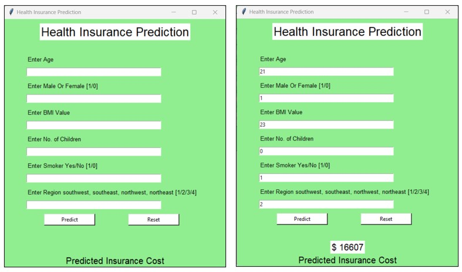

# Health Insurance Cost Prediction

## Introduction 
The project is a study of different regression algorithms in machine learning. Regression is a statistical method to model the relationship between dependent (target) and independent (predictor) variables with one or more independent variables. Regression helps find the correlation between variables and enables us to predict the continuous output variable based on one or more predictor variables. It is mainly used for prediction, forecasting, time series modeling, and determining the causal-effect relationship between variables. Health insurance costs are based on independent variables to predict the dependent variable 'charges.' As a result, health insurance cost prediction is the best example to perform a study on the different regression algorithms.

## Dataset 
The dataset is taken from a Kaggle. You can download the dataset from [here](https://www.kaggle.com/datasets/mirichoi0218/insurance)

## Approach 
Applying machine learing tasks like Data Exploration, Data Cleaning, Feature Engineering, Model Building and model testing to build a solution that should able to predict the premium of the personal for health insurance.

- **Data Exploration :** Exploring the dataset using pandas, numpy, matplotlib and seaborn.
- **Exploratory Data Analysis :** Plotted different graphs to get more insights about dependent and independent variables/features.
- **Feature Engineering :** Numerical features scaled down and Categorical features encoded.
- **Model Building :** In this step, first dataset Splitting is done. After that model is trained on different Machine Learning Algorithms such as:
    1) Linear Regression
    2) Support Vector Regressor
    3) Random Forest Regressor
    4) Gradient Boosting Regressor
- **Model Selection :** Tested all the models to check the RMSE & R-squared.
- **Model Save :**  Selected model as per best RMSE score & R-squared and created using joblib library.
- **GUI :** Created a GUI that takes all the necessary inputs from the user & shows the output.

## Libraries used 
    1) Pandas
    2) Numpy
    3) Matplotlib
    4) Scikit-Learn
    5) Joblib

## Technical Aspects :
    1) Language : Python 
    2) Front-end : Tkinter

## How to run the project 
    1) Clone the repositry or dowmload the zip.
    2) Open Terminal in VS Code.
    3) Enter the command: python app.py

## GUI 

## Results

Model gave 87% accuracy for Health Insurance Cost Prediction using <code>Gradient Boosting Regressor</code>
